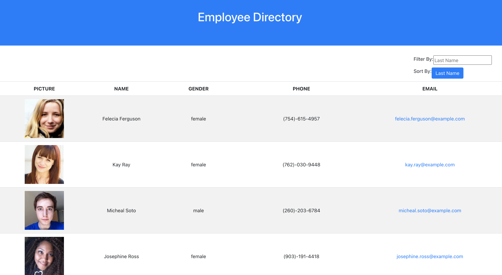

# EMPLOYEE DIRECTORY

## Description

Employee Directory is React app that displays a table of dynamically generated employee information
and allows the user to filter and sort through the directory.
The app uses the node package Axios to make a call to a 3rd party API called Random User Generator

App deployed to https://alidemirbay.github.io/employee-directory/

